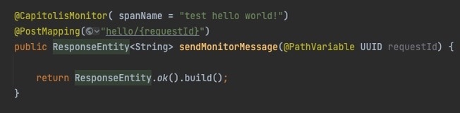
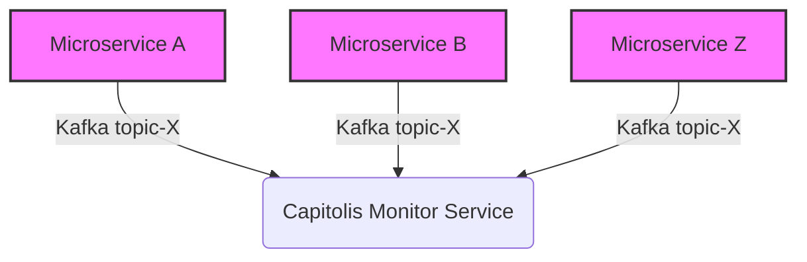

  
  <h3 align="center">Capitolis Monitor Common Library</h3>

  

    The Capitolis-Monitor-Common Library should be used by the "Monitored" microservices.
     
    <a href="https://capitolis.atlassian.net/wiki/spaces/MD/pages/3116433409/Capitolis+Monitor+Common+Lib"><strong>Explore confluence pages »</strong></a>
     
  

  
Table of Contents

  <ol>
    <li>
      <a href="#about-the-project">About The Project</a>
    </li>
    <li><a href="#how-the-monitor-look-like">How The Monitor Look Like</a></li>
    <li>
      <a href="#high-level-architecture">High Level Architecture</a>
    </li>
    <li><a href="#getting-started">Getting Started</a></li>
    <li><a href="#capitolis-monitor-service">Capitolis Mointor Service</a></li>
    <li><a href="#roadmap">Roadmap</a></li>
  </ol>

## About The Project
The goal of this project is to publish monitor messages in a "story-telling" fashion, that can be used for debug in the Monitoring-Service. 

The Mointored service will publish messages to Kafka using topic-name: capitolis.monitor.out.kafka.topic 

 

## How The Monitor Look Like
<!--put monitor output example screenshot her: [![Product Name Screen Shot][product-screenshot]](https://monitor-swagger) -->

## High Level Architecture

## Getting Started
Please see: [How to use the Monitored-Common-Lib](https://capitolis.atlassian.net/wiki/spaces/MD/pages/3116433409/Capitolis+Monitor+Common+Lib)

## Capitolis Mointor Service

[Capitolis-Monitor-Service]: https://github.com/Capitolis/cptls-market-data-monitor

## Roadmap

- [x] Publish MonitorMessage event over Kafka.
* Upon demand.